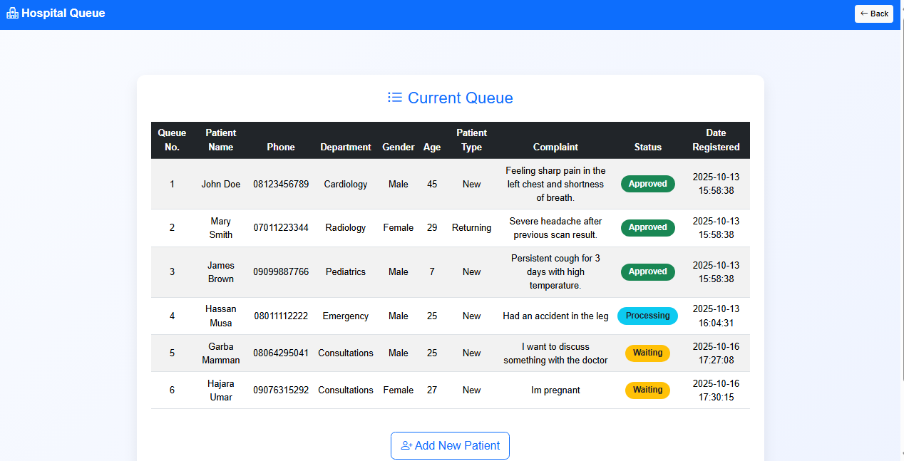

# 🏥 Hospital Queue System

A web interface to manage patient queues and statuses for clinic/reception use.

---

## 🧠 Tech Stack
HTML | CSS | JavaScript | Bootstrap | PHP (basic)

---

## ✨ Features
- Patient check-in form
- Queue dashboard showing waiting/processing/completed
- Call/next and status update controls
- Mobile-friendly interface for tablets and phones

---

## ⚙️ How to Run
1. Clone repo.
2. For PHP features, host on XAMPP/WAMP and import `database.sql` if provided.
3. Open the dashboard in your browser.

---

## 📸 Screenshots

---

## 📄 License
Portfolio project.
